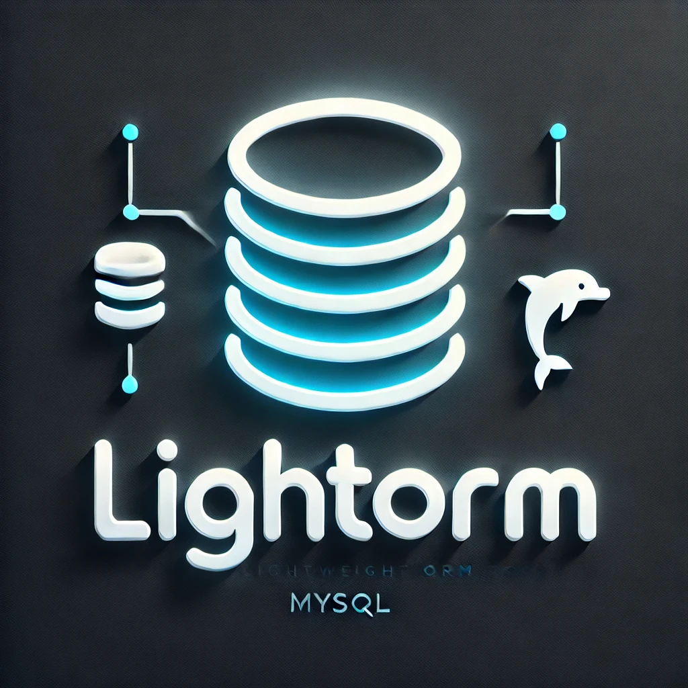

# 🚀 LightOrm

<p align="center">
  
</p>

A high-performance, lightweight ORM (Object-Relational Mapping) library for .NET and Unity, providing seamless MySQL database integration with advanced features like intelligent caching, relationship mapping, and async support.


## ✨ Features

### Core Features
- 🔄 **Intelligent Caching System**
  - Hash-based cache invalidation
  - Memory-efficient caching strategy
  - Automatic cache management
  - Support for both single and batch queries
- 🔗 **Rich Relationship Support**
  - One-to-One relationships
  - One-to-Many relationships
  - Many-to-Many relationships
  - Self-referencing relationships
  - Custom association tables
- 🎮 **Cross-Platform**
  - Works with standard .NET applications
  - Seamless Unity integration
  - Consistent API across platforms
- 🛠 **Developer-Friendly**
  - Fluent API design
  - Strong typing support
  - Async/await pattern
  - Clean, model-based approach

### Technical Features
- 📦 Automatic table creation and schema management
- 🔒 Transaction support with async/await
- 🌊 Connection pooling for optimal performance
- 🔍 Attribute-based mapping
- 🚦 Smart query optimization
- 🔄 Batch operations support

## 📥 Installation

### Standard .NET Applications

1. Add LightOrm.Core to your solution:
```bash
dotnet add reference path/to/LightOrm.Core.csproj
```

2. Install required MySQL package:
```bash
dotnet add package MySql.Data
```

### Unity Projects

1. Import required DLLs to Assets/Plugins:
   - LightOrm.Core.dll
   - LightOrm.Unity.dll
   - MySql.Data.dll

## 📝 Usage Examples

### Basic Model Definition

```csharp
public class UserModel : BaseModel<UserModel>
{
    public override string TableName => "users";

    [Column("name", length: 100)]
    public string Name { get; set; }

    [Column("email", length: 255)]
    public string Email { get; set; }
}
```

### Advanced Relationships

```csharp
// Department with One-to-Many relationship
public class DepartmentModel : BaseModel<DepartmentModel>
{
    public override string TableName => "departments";

    [Column("name")]
    public string Name { get; set; }

    // One-to-Many: Department has many Employees
    [OneToMany("department_id", typeof(EmployeeModel))]
    public EmployeeModel[] Employees { get; set; }
}

// Employee with Many-to-Many relationship
public class EmployeeModel : BaseModel<EmployeeModel>
{
    public override string TableName => "employees";

    [Column("name")]
    public string Name { get; set; }

    // Many-to-Many: Employees can be in multiple Projects
    [ManyToMany(
        typeof(ProjectModel),
        associationTable: "employee_projects",
        sourceForeignKey: "employee_id",
        targetForeignKey: "project_id")]
    public ProjectModel[] Projects { get; set; }
}
```

### Database Operations

```csharp
// Connection setup
var builder = new MySqlConnectionStringBuilder
{
    Server = "localhost",
    Database = "your_db",
    UserID = "user",
    Password = "pass"
};

using var connection = new MySqlConnection(builder.ConnectionString);
await connection.OpenAsync();

// Create and save
var user = new UserModel { Name = "John", Email = "john@example.com" };
await user.SaveAsync(connection);

// Load with relationships (uses caching)
var loadedUser = await UserModel.FindByIdAsync(connection, user.Id, includeRelated: true);

// Batch operations with cache
var allUsers = await UserModel.FindAllAsync(connection);
```

### Unity Integration

```csharp
public class GameController : MonoBehaviour
{
    private async void Start()
    {
        using var connection = DatabaseManager.Instance.GetConnection();
        
        var player = new PlayerModel
        {
            Username = "Player1",
            Score = 1000
        };
        
        await player.SaveAsync(connection);
    }
}
```

## 🎯 Performance Features

### Intelligent Caching
- Automatic cache invalidation using hash versioning
- Memory-efficient caching with smart eviction
- Support for relationship caching
- Batch operation optimization

```csharp
// First load (from database)
var user = await UserModel.FindByIdAsync(connection, 1);

// Second load (from cache)
var cachedUser = await UserModel.FindByIdAsync(connection, 1);

// Cache invalidation on update
user.Name = "Updated Name";
await user.SaveAsync(connection); // Automatically updates cache
```

### Relationship Loading Optimization
- Lazy loading support
- Eager loading for required relationships
- Batch loading for collections
- Smart query generation

## 🧪 Testing

The project includes comprehensive tests covering:
- Basic CRUD operations
- Relationship scenarios
- Cache performance
- Edge cases
- Stress testing

Run tests using:
```bash
dotnet test LightOrm.Tests
```

## 📚 Best Practices

1. **Connection Management**
   ```csharp
   using var connection = new MySqlConnection(connectionString);
   ```

2. **Error Handling**
   ```csharp
   try
   {
       await model.SaveAsync(connection);
   }
   catch (MySqlException ex)
   {
       // Handle database errors
   }
   ```

3. **Transaction Usage**
   ```csharp
   using var transaction = await connection.BeginTransactionAsync();
   try
   {
       // Multiple operations
       await transaction.CommitAsync();
   }
   catch
   {
       await transaction.RollbackAsync();
   }
   ```

## 📄 License

MIT License - See [LICENSE](LICENSE) for details.

## 🤝 Contributing

Contributions are welcome! Please feel free to submit pull requests.

1. Fork the repository
2. Create your feature branch
3. Commit your changes
4. Push to the branch
5. Open a Pull Request
